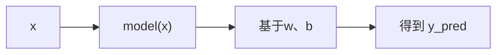
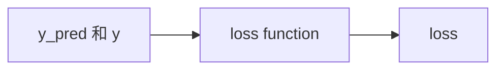
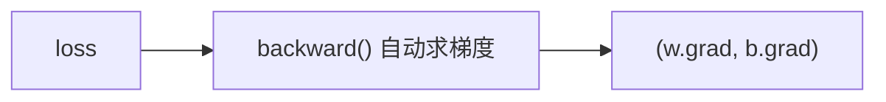
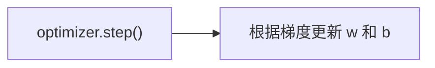

# PyTorch
#### 是一个深度学习框架: 主要特点是**动态图机制**

---

## Tensor(张量)
>是基本单元, 他可以是任何维度的数据
```python
torch.tensor() # 创建torch
torch.zeros(x, y) # 创建全0的torch
torch.from_numpy() # 从numpy继承(分享内存)
x[0, 1]; x[:, 1]; x[1, :] # 切片
"索引和切片和list基本一样"
x.view(x, y) # 矩阵变形
"计算支持 + - * @ , 其中 @ 是点积"
```

---

## Autograd(自动求导机制)
>自动记住张量之间的操作过程, 通过`backpropagation`(反向传播)求梯度

#### 基本概念
- `Tensor` | 数据本体(数字、矩阵)
- `requires_grad` | 标记这个`Tensor`是否需要求导
- `grad_fn` | 记录当前`Tensor`是由哪个函数生成的
- `backward` | 执行反向传播, 自动计算梯度
- `grad` | 保存反向传播得到的梯度值

```python
import torch

x = torch.tensor(2.0, requires_grad=True)
"requires_grad = True 是追踪Tensor的所有计算"

y = x ** 2 + 3 * x + 1  # y = x^2 + 3x + 1

y.backward()
"自从y开始往回推导每一步, 最终算出每个叶子节点(比如x)的梯度"

# 查看梯度
print(x.grad)
```

---

## 搭建第一个线性回归模型
>创建并训练小模型, 学习规律 `y = 2x + 3`

#### 训练流程
| 步骤 | 说明 |
|---|---|
|准备数据|输入x和标签y|
|定义模型|搭建神经网络结构(比如线性层)|
|定义损失函数|衡量预测值和真实值差距|
|定义优化器|告诉模型如何更新参数|
|训练循环|多轮次训练, 让模型逐步拟合数据|

#### 已知一组数据
|x|y|
|-|-|
|1|5|
|2|7|
|3|9|
|4|11|
>其实就是隐藏了 `y = 2x + 3` 这个规律, 要让模型自己学出来

#### 准备数据
```python
import torch
x = toech.tensor([[1.0], [2.0], [3.0], [4.0]])
y = torch.tensor([[5.0], [7.0], [9.0], [11.0]])
```

#### 定义模型
```python
import torch.nn as nn
model = nn.Linear(1, 1)
"定义线性回归模型, 输入一个特征, 输出一个特征"
```
>`nn.Linear(1, 1)`就是 y = wx +b 的结构, w 和 b 是自动学习的

#### 定义损失函数
```python
loss_fn = nn.MSELoss()
```
>Mseloss = 均方误差损失函数, 常用来衡量回归任务

#### 定义优化器
```python
import torch.optim as optim
optimizer - optim.SDG(model.parameters(), lr = 0.01)
```
>使用随机梯度下降(SGD), 学习率 lr = 0.01
>学习率 lr 决定了参数更新的幅度，是训练快慢和稳定性的关键控制器

##### 关于学习率 `lr`
> 学习率 `lr` 描述的是每一次循环学习后 `w` 和 `b` 的变化程度。

公式为：
\[
\theta = \theta' - lr \cdot g
\]
其中：
- `θ` 是模型的参数（例如权重 `w` 或偏置 `b`）
- `g` 是损失函数对参数 `θ` 的梯度（即 \(\frac{\partial \text{loss}}{\partial \theta}\)）

学习率 `lr` 决定了每次更新的步长大小，步长过大容易震荡，步长过小则收敛变慢。

#### 训练循环
```python
for epoch in range(300): # 训练300轮
    "前向传播"
    y_pred = model(x)

    "计算损失"
    loss = loss_fn(y_pred, y)

    "反向传播"
    optimizer.zero_grad() # 清空梯度
    loss.backward() # 反向传播
    optimizer.step() # 更新参数

    if (epoch + 1) % 50 == 0:
        print(f"Epoch {epoch + 1}: loss = {loss.item():.4f}")
```
##### 核心流程
###### 前向预测
- 把 **输入数据x** 送进模型, 得到 **预测值y_pred** 
- 前向传播是 **普通数值计算**, 不会动梯度


###### 计算误差
  - 比较 **真实标签y** 和 **预测结果y_pred** 的distance（距离）
  - 使用 **loss function**（损失函数）来描述distance的值
  - 这里使用的是 **均方误差MSE**
      $$ loss = \frac{1}{n} \sum (y_{pred} - y_{true})^2 $$
  - **损失值loss** 是反应当前模型「好不好」的量


###### 自动求梯度
  - 反向传播, **自动计算所有需要优化的参数(w, b)的梯度**
  - 原理: 
    - 从`loss`开始, 自动一层一层**反向链式求导**(链式法则 Chain Rule)
    - 计算出 $\frac{∂loss}{∂w}$ (w的变化对loss的影响) 和  $\frac{∂loss}{∂b}$(b的变化对loss的影响)
        梯度向量$▽L = (\frac{∂L}{∂w}·\frac{∂L}{∂b})$
    - 将这些梯度保存到`model.weight.grad`和`model.bias.grad`


###### 更新参数
- 根据计算出的梯度, **更新`w`和`b`的值**, 使他们朝着减小`loss`的方向前进


#### 检验学习结果
```python
print(f"Learned weight: {model.weight.item():.4f}")
print(f"Learned bias: {model.bias.item():.4f}")
```
>通过输出查看模型是否学习到规律

```pthon
Epoch 50: loss = 3.2731
Epoch 100: loss = 2.2759
Epoch 150: loss = 1.6397
Epoch 200: loss = 1.2338
Epoch 250: loss = 0.9748
Epoch 300: loss = 0.8096
训练进度: 100%|███████████████████████| 300/300 [00:00<00:00, 2988.35it/s]
Learned weight: 1.9994
Learned bias: 3.2610
```
>通过观察, 一共进行了`300`次训练, 每`50`次训练输出一次`loss`
>`loss`前期下降快, 后期下降变慢, 说明模型学习到了不错的规律
